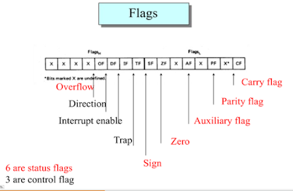
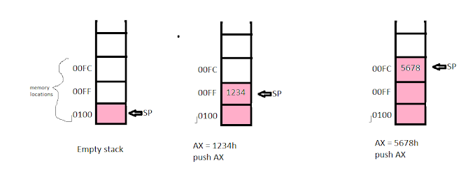

# programming in emu8086 (with brief theory)

Hopefully, we all know the basic architecture of 8086. We will also briefly discuss it along with the sample code. Let's start ☺  
👉This is not case sensitive language. So int and INT seems equivalent to it.  
👉To comment in code we have to put ( ; )  

# Let's take a single input💦  

⚠️Do you know?:  
👉We have 4 types of data resister- `AX`, `BX`, `CX`, `DX`. In 8086 each of them is `16-bit`. Again we divide 16-bit into two 8 bit. Like `AX = AL+ AH` ( 16 = 8 + 8). 

## Steps to take single input - 
   💣Set the value of `ah(AH)` to 1. For this, we have to write- 
  `mov ah,1`   
  💣Give the command to execute. When we have 1 in `ah` and instruct to execute then it will take input and the default input location is `al`.
   For this we have to write- 
   `int 21h`    ; command to execute  
   
   ## code-

   
      .model small
      .stack 100h

      .data
      .code
          main proc

              mov ah,1; Just focus on these two lines, else are just a structure, 
              int 21h ; else are like #include and main() in C you can think off now

          main endp
      end main

# Let's give output💦
⚠️Do you know? How physical memory address is calculated?  
👉In 8086 physical address is `20` bit. From the logical address of segment address and offset address we calculate the physical address. If, 
`segment address = 213A`  &   `offset address = 31B1`, then `physical address = 213A0 + 31B1`.  
What will happen if we get more than 20 number after addition? (https://stackoverflow.com/questions/6718783/calculation-of-physical-address-in-8086)  

## Steps to print output - 
  💣Set the value of `ah(AH)` to `2`. For this, we have to write- `mov ah,2`  
  💣What we want to print, move that value in `dl`. dl is the default location to print output.
  💣Give the command to execute. When we have 2 in ah and instruct to execute then it will give output and the default location from which output will come in dl. 
   For this, we have to write- `int 21h`    ; command to execute
   
## code-
         .model small
         .stack 100h

         .data
         .code
             main proc

                 mov ah,1 ;prepqring ah to take input in al 
                 int 21h ;execute command. By this command code will take input
                         ; and will store that in al,as ah is now 1 
                 mov ah,2 ;preparing ah to print from dl
                 mov dl,al ;assaigning value of al in dl
                 int 21h ;exexute command. By this command output will be 
                         ;printed from dl, as ah is now 2    

             main endp
         end main
         
## In the above code, input and Output is printed in the same line. Let's print output in a new line-
         .model small
         .stack 100h

         .data
         .code
             main proc

                 mov ah,1 ;prepqring ah to take input in al 
                 int 21h ;execute command. By this command code will take input
                         ; and will store that in al,as ah is now 1 
                 mov bl,al ;moving the input value in bl. 

                 mov ah,2 ;preparing ah to print from dl
                 mov dl,0dh ;0dh is carriage return
                 int 21h ;as al=2, execute command will print from dl
                         ;as dl=0dh, it will move the cursor to left

                 mov ah,2 ;preparing ah to print from dl
                 mov dl,0ah ;0ah is carriage return.       
                 int 21h ;as al=2, execute command will print from dl
                         ;as dl=0ah, it will move the cursor to new line 

                 mov ah,2 ;preparing ah to print from dl
                 mov dl,bl ;assaigning value of bl in dl
                 int 21h ;exexute command. By this command output will be 
                         ;printed from dl, as ah is now 2    

             main endp
         end main
         
In line 15 we have set the value of ah to 2, so until we again set it to 1 it will continue to take input. That means line 21 & 27 is not needed.

# Let's print the string💦(coming ....)
Do you know? The types of data resister? ............ (comming)  

# Let's learn aboutcondition and jump💦
👉First, we will see the unconditional jump  
👉Then different types of conditional jump

## unconditional jump -
   💣If you are familiar with C, then you can compare `jump` with `goto`  
   💣jmp keyword is used to make a jump  
   💣the syntax is `jmp label_name`  
   💣after seeing jmp program will jump to the label where we defined it  

In the below code we will take 2 input, and will write code to print both inputs. But before that, we will write an unconditional jump statement which will jump to a label without printing one input and print the next one. So, the code will show one output.  

## code-
         .model small
         .stack 100h
         .data

         .code
             main proc
                 ;first input
                 mov ah, 1 ; preparing ah to take input in al
                 int 21h
                 mov bl, al

                 ;going to new line
                 mov ah, 2 ; preparing ah to print from dl
                 mov dl, 0dh ;0dh is carriage return
                 int 21h
                 mov dl, 0ah ; 0ah is line feed
                 int 21h

                 ;second input
                 mov ah, 1 ; preparing ah to take input in al
                 int 21h
                 mov bh, al

                 jmp label_x  ; instruction to jump to label_x

                 ;going to new line
                 mov ah, 2 ; preparing ah to print from dl
                 mov dl, 0dh ;0dh is carriage return
                 int 21h
                 mov dl, 0ah ; 0ah is line feed
                 int 21h

                 mov ah, 2 ; preparing ah to print from dl
                 mov dl, bh
                 int 21h

             label_x:
                 ;going to new line
                 mov ah, 2 ; preparing ah to print from dl
                 mov dl, 0dh ;0dh is carriage return
                 int 21h
                 mov dl, 0ah ; 0ah is line feed
                 int 21h

                 mov ah, 2 ; preparing ah to print from dl
                 mov dl, bl
                 int 21h       

             main endp
         end main
         
If we give 2 & 5 input to the program, the program will print 2. But without using jump the output would be 5 & 2.
This is an `unconditional` jump. No condition will be checked, as soon as the line 'jump label_x' is executed program makes a jump.  

## conditional jump -
We can classify jump condition on the basis of the signed number and unsigned number.
For signed number, we use    : `jl`     `jg`     `jle`     `jge`     `je`     `jnl`     `jng`     `jnle`     `jnge`
For unsigned number, we use: `ja`    `jb`     `jbe`    `jae`     `je`     `jnb`    `jna`     `jnbe`    `jnae`
`je` is common for both signed and unsigned number.

Meanings of these key-words-  
- jl      => jump if less  
- jg     => jump if greater  
- jle    => jump if less or equal  
- jge   => jmp if greater or equal  
- jnl    => jump if not equal  
- je     => jump if equal  
- ja     => jump if above  
- jb     => jump if below  
- jbe   => jump if below or equal  
- jnbe => jump if nor=t below or equal  
- jnae => jump if not avobe or equal  
etc....  

## Difference between signed jump condition and unsigned jump condition:
 We know in emu8086 we can have `8` bit or `16-bit` number. For simplicity let's consider we have only 8-bit number. Then if we want to consider the `signed` number then the `8th` bit will represent the `sign(1=negative, 0=positive)`. If we consider the `unsigned` number then the `8th` bit will be considered as a part of the `value`.  

⚠️Let's take a question: a = 71 h  and b = 81 h ( h for hexadecimal), now which one is greater, a or b?  
👉The answer is, we can't say which one is greater until we know if we have to consider it as a signed or unsigned number. But why?  
👉lets represent the hexadecimal number in binary :  

                          a = 71 h =  0111 0001 b (we considered as 8-bit resister)
                          b = 81 h = 1000 0001 b 
                                            
👉If we consider a and b as a signed number then, b is a negative number, as the 8-th bit is 1, so obviously `b < a`.  
👉again, if we consider the unsigned number, then both of them are positive, and 8-th bit will contribute to the value.  so `b > a`  

👉If we consider the signed number then we must use the signed jump condition, if we just consider the value then we must use the unsigned jump condition  

**Note: for comparing to resister, the size of resister should be the same `(we can't compare bx with cl)`**

# Let's check Loop operation💦
## Steps for using loop instruction - 
   💣loop instruction is directly related to `cx` resister.  looping process will continue until the value of cx resister become `0`.  
   💣First, we will set the value of cx resister to the number(say n) we want to loop.  
   💣Then we will declear a label and do some work under the label and then write the loop instruction. the work under the label will be perform  n times.  

**Note: Loop will always integrate on the value of cx. If we put ch =0 and cl = any_8_bit_number, then the value is also equal to the value of `cl`.**

# Let's Learn about the flag register💦

 

In emu8086, the flag register is of `16-bits`, and it has `9 flags`, other bits are `undefined`.  
We can divide the 9 flags into 2 groups.   
- Control flags (`TF, IF, DF`)   
- Status flags (`CF, PF, AF, ZF, SF, OF`)   

## Let's first talk about the status flags- 
### Status flags are -         
  👉 `CF` = `Carry Flag` (If there is a carry from MSB or a borrow in MSB then CF will be 1. If we are doing arithmetic, then we will consider CF.)  
  👉 `PF` = `Parity Flag` (We will make odd parity. If in the lower 8-bit , number of 1 is even then Pf = 1)   
  👉 `AF` = `Auxiliary Carry Flag` (if there is a carry out from bit 3(4th bit from right) on addition, or there is a borrow into the bit 3 on subtraction, then AF = 1)   
  👉 `ZF` = `Zero Flag` (After operation if result is 0 then ZF  = 1)   
  👉 `SF` = `Sign Flag` (If resultant MSB is 1 then SF =1 )   
  👉 `OF` = `Overflow Flag`  (If signed overflow occur then OF = 1)  
### The most confusing flag if `OF`. Let's simplify the condition for OF  to be 1. We can think of `two points`. OF will be 1, if both the two points hold - (for addition) 
- The MSB of both operand must be the same.
- MSB of the result will be the opposite of the operands.

### Why these two points? 
=> MSB is different means, one operand is positive and another is negative. By adding one positive with a negative, overflow can't occur. Now if point 1 is fulfilled, then result MSB is different means that - adding two negative we have got positive or vice-versa, so then OF will be 1.  

### Let's do some exercise-
***Ex-1:***  
***`ax = FFFF h`    and     `bx  = 0001 h`, now add `ax` and `bx` and say which types of overflow occurs. signed or unsigned?***  
***=>***  

       FFFF h =    1111 1111 1111 1111 b
       0001 h =    0000 0000 0000 0001 b 
      ax + bx  = 1 0000 0000 0000 0000 b. 

if we consider the two points mentioned above, then we can easily say that no signed overflow has occurred. So OF = 0. But the is a carry out from the  MSB, so CF = 1, which means `unsigned overflow occurred`.  
Let's think logically, why it is not signed overflow.   
let, ax and bx are signed numbers, then MSB represents sign. MSB of ax is 1, so ax contains a negative number, on the other hand, MSB of bx is 0, so bx is a positive number. by adding a positive+negative no overflow can't occur. So OF = 0;  
Let, ax and bx are the unsigned numbers. SO MSB will also add to the value. And after adding the values there is a carry out, so unsigned overflow occurred. CF =1 .  

***Note: if we consider numbers as signed, then negative numbers are in the 2's complement form.***  

***EX-2:***  
***ax  = 7FFF h   and bx = 7FFF h. add ax and bx and find the value of CF and OF.***  
***=>***  

      7FFF    = 0111 1111 1111 1111 
      7FFF    = 0111 1111 1111 1111 
      ax+bx =  1111 1111 1111 1110 

considering the above two points, OF  = 1  
no carry out fro MSB  so,   CF = 0  

***EX-3:***  
***ax  =  FFFF h and bx = FFFF h. add ax and bx and find the value of CF, OF, PF, AF, SF, ZF.***  
***=>***  

      ax =         1111 1111 1111 1111 
      bx =         1111 1111 1111 1111 
      ax+bx =    1 1111 1111 1111 1110 
      
      so,
      CF = 1 
      OF = 0 
      PF = 0 
      AF = 1 
      SZ = 1 
      ZF = 0 

***EX-3:***  
***ax = 8000 h. what will be the value of status resisters after doing the operation -  neg ax ?***  
***=>***  
***Note: For negation operation, Thye value of CF is always 1 unless the result is 0.***  

             ax = 80000 h = 10000 0000 0000 0000 b 
             
            negative numbers are stored i 2's complement form. 2's complement of ax is
             ax              =   1000 0000 0000 0000 
             1's complement  =   0111 1111 1111 1111
                                 0000 0000 0000 0001
             2's complement  =   1000 0000 0000 0000

            So, 
            SF = 1  (MSB =1)
            PF = 1 (number of 1 in last 8 bit is 0)
            ZF = 0 (result is non zero)
            CF = 1
            OF = 1 (1's complement and 1 are positive(MSB 0),  2's complement is negative(MSB 1)  )

# Let's check variable💦
👉db  = 1 byte  
👉dw = 2 byte  
👉dd = 4 bute  
👉dq = 8 byte  
👉dt = 16 byte  

    Syntax : variable_name       defien_derective(type)        initial_value

***Note: if we don't want to initialize any value we can put a ? at that palace.***  

⚠️Do you know: We can't compare between two variable, One must be a resister.

## Steps for using variable - 
   💣First, we have to declare the variable in the data segment
   💣to use the declared variable in the data code we have to write two lines-
   
                        mov ax,@data
                        mov ds,ax
               

more coming ......  

# Let's do multiplication and division💦
***Note: One special use of ax and dx is multiplication and division.***  

## Multiplication:
According to sign, there are two types of multiplication:  

                     1) Signed multiplication (mul)              2)Unsigned multiplication (imul)
                                    
According to bit, there are two types of multiplication: 

                     1) byte multiplication               2)word multiplication
                                    

### Byte multiplication:
Both of the operands should be a byte (8-bit). `al` is the `default operand`, and another one can be any 8-bit register or variable.  
Syntax:   ***`mul source`*** (here the source is any 8-bit register or variable)  
 This is equivalent as:  `ax = al * source`.  So after multiplying 2 8-bit number `result` is stored in a 16-bit register, which is `ax`.

### Word multiplication: 
Both of the operands should be a word (16-bit). `ax` is `the default operand`, and another one can be any 16-bit register or variable.  
Syntax:   ***`mul source`*** (here the source is any 16-bit register or variable)  
 This is equivalent as:  `dx:ax = ax * source`.  So after multiplying 2 16-bit number `result` is stored in a two 16-bit register: `dx and ax`. Higher 16 bit (`MSB`) of result is saved in `dx`,  and lower 16-bit (`LSB`) is saved in `ax`.

## Let's see the difference between signed and unsigned multiplication:
### Word multiplication: 
Let `ax = FFFF h`, `bx = FFFF h`  

### Unsigned: (`mul` is used for `unsigned multiplication`)
        mul bx  
        is equivalent to dx : ax = ax *  bx
        here ax = bx = 1111 1111 1111 1111 in binary = 65535 in decimal
        so, dx:ax = ax * bx = 4294836225 in decimal = FFFE0001 in hexadecimal
        so, dx = FFFE h and ax = 0001 h  
    
  
### Signed: (`imul` is used for `unsigned multiplication`)
        imul bx  
        is equivalent to dx : ax = ax *  bx
        here ax = bx = 1111 1111 1111 1111 in binary ; which is in 2's complement. If we consider signed  value 
                       0000 0000 0000 0000  
                                        +1
                       0000 0000 0000 0001   
                so, ax = bx = -1 in decimal
                so, dx:ax = ax * ax = 1 in decimal = 00000001 in hexadecimal
                so, dx = 0000 h and ax = 0001 h                       

Byte multiplication:  

Let's see the flag resister change for multiplication:  

## Division:

### Byte division: 
syntax:  ***`div  dividend`***  (dividend  is 8-bit resister od variable)

              It is equivalent to:    ax / dividend (remainder = ah, quotient = al)

### Word division
syntax:  ***`div  dividend`***  (dividend  is 16-bit resister od variable)

              It is equivalent to:     dx:ax / dividend (remainder = dx, quotient = ax)
              
              
# Let's learn about stack💦
When we write ` .stack 100h`   program reserves `100 bytes` for the stack.  
We represent stack memory as `SS:SP`  
`SS = Stack segment` (hold the beginning address of stack)  
`SP = Stack pointer` (hold the address of the top of the stack. this is a 16-bit register)  

## PUSH:
Syntax:  `PUSH source`
              Here the source is a 16-bit resister (ax,bx etc.) or 16-bit memory variable.  
We can also push the flag resister into the stack as it is a 16-bit register. For this we have to write: `PUSHF`  
When we use push-  
- SP is decremented by 2
- Source value will be stack at the position of SP

### Visualization of push:
 

## POP:
Syntax: `POP destination`  
  Here the destination is a 16-bit register or a 16-bit variable. so poped element will be stored into the destination.  
We can also flag resister as the destination for pop. Syntax is `POPF`  

If the stack is empty then `SP = 0100h`  

 👉[***try this problem***](practice_problems/05.md)

# Let's learn about the procedure💦
Syntax:  

         Procedure_name     proc    type
                             ; body

                             ret
         Procedure_name      endp

- Here type can be of two types: `near` and `far`. By `default` it is `near`, It is not mandatory to specify the type.  
When we use near and call a procedure from main then main procedure and the called procedure are in the same segment(.code segment). Otherwise, they are in a different segment.  

`ret:` If we don't write this after the execution program will not come back from where it was called. it will just normally go to the next line.  
***`Note: If we write ret in the main procedure then it will create an infinity loop.`***

we can also use a number after `ret`: that is, if we write `ret 4` then first it will pop the stack top then it will also `pop (4/2) = 2 word` from the stack.  

### How the procedure works:
When we call a procedure from the `n-th` line then the address of the `n+1` th line is pushed into the `stack`. When the program `finds ret`, it `pops the top` of the stack and `save it to IP`.  
So, if we push something into stack inside procedure then we must pop them before writing ret, otherwise program will not be able to get back to the n+1 th line.  

### 3 common ways to pass parameters in the procedure:
- Through resister
- Through the global variable
- Through stack

